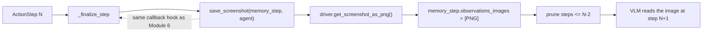

# Module 11 — Vision and Multimodal: Quill Reads Charts and the Web

Quill from Module 10 is a manager `CodeAgent` over a `web_researcher` sub-agent. It **writes**
charts with `save_chart` — and then moves on **without ever looking at them**. It trusts its own
matplotlib. On a real analysis that bites: a Y-axis starting at 80 exaggerates a 3% bump into an
"explosion", two series overlap into mush, a legend runs off-canvas. The report ships, the chart
lies, and nobody — least of all Quill — saw a pixel. And some sources (JS dashboards, canvas
charts) give a text scraper **nothing**.

This module gives Quill **eyes**:

- it **re-reads its own charts** with a **VLM** (vision-language model) via `run(images=[...])` —
  a visual sanity-check of its output (`review_charts` in `quill/agent.py`);
- and, optionally, gains a `vision_browser` sub-agent (`quill/team.py`) that drives a real browser
  (helium + Chrome) and *looks at screenshots* of JS-heavy pages, injecting them into its memory
  via a `step_callback`.

## Two ways to give an agent an image (and why the difference is the whole point)

`MultiStepAgent.run(task, stream=False, reset=True, images=None, additional_args=None,
max_steps=None, return_full_result=None)` has TWO image-shaped channels, and they are NOT the same:

| | `run(images=[pil, ...])` | `additional_args={"chart": path_or_pil}` |
|---|---|---|
| What reaches the model | **vision content** the model LOOKS AT | a **named Python variable** in the sandbox |
| Where it lives | the message stream (`TaskStep.task_images`) | the executor namespace |
| Use case | *"look at this and answer"* | *"load this and compute on it"* |
| Quill example | re-read a chart for honesty | pass a CSV/image path to manipulate |

> ⚠️ **Common misconception: "Passing an image in `additional_args` lets the model see it."**
> False. `additional_args` puts a *variable* in the sandbox — if the model is not a VLM, or you do
> not show it the image via `images=`, it sees nothing; it can only write code that touches the
> object. To make the model *look*, it is `images=` (and a VLM).

So `review_charts` re-reads each saved PNG through `run(images=[pil_image])` — the channel the
model looks at. (`additional_args` is also the hook a **manager** uses to pass rich objects DOWN to
a sub-agent — the same channel from Module 10, reused.)

## Vision needs a VLM — and `flatten_messages_as_text` is the silent gatekeeper

Vision is a property of the **model**, not of smolagents. Use a **VLM**:
`InferenceClientModel(model_id="Qwen/Qwen2-VL-72B-Instruct")`, or `gpt-4o` / Claude 3.5 Sonnet via
`LiteLLMModel`. In Quill, that VLM comes through the frozen `make_model` — just point
`QUILL_MODEL_ID` at one. **No extra is required for image input.**

`flatten_messages_as_text` is the flag that quietly decides whether your image blocks survive:

| Model class | `flatten_messages_as_text` default | Image blocks |
|---|---|---|
| `InferenceClientModel` / `OpenAIModel` / `AmazonBedrockModel` | `False` | **preserved** |
| `LiteLLMModel` (most ids) | `False` | preserved |
| `LiteLLMModel` for `ollama/…`, `groq/…`, `cerebras/…` | **`True`** | **flattened to text → images LOST** |

When it is `True`, the message is flattened to plain text and the image is silently dropped — the
#1 reason vision "fails for no reason" on a LiteLLM/Ollama backend.

> ⚠️ **The naming trap (T11.4).** `pip install 'smolagents[vision]'` installs **helium + selenium**
> — a *browser* (the vision-web-browser example's automation). It does **NOT** enable image input.
> Image input (`run(images=...)`) depends ONLY on the model being a VLM. Many readers install
> `[vision]` expecting images to work; that is not what it does.

`AgentImage` (T3.10): when a tool or answer produces an image, smolagents wraps it in `AgentImage`,
which behaves like a `PIL.Image` — `.to_raw()` gives back the PIL image (ready for `images=[...]`),
`.to_string()` a serialized path, `.save(...)` writes it.

## Letting Quill *see* a page: the screenshot `step_callback`

For JS/chart-heavy pages a text scraper misses, smolagents' canonical pattern is a `CodeAgent` that
drives **helium** (over selenium, Chrome) in its sandbox, plus a `step_callback` that screenshots
every step into memory. Module 11 ships that as `save_screenshot` in `quill/callbacks.py` — the
**same callback hook as Module 6**, in its full vision form:

```python
def save_screenshot(memory_step: ActionStep, agent: CodeAgent) -> None:
    sleep(SCREENSHOT_SETTLE_SECONDS)         # let JS/animations settle
    png, url = _screenshot_png()             # helium.get_driver().get_screenshot_as_png()
    if png is not None:
        memory_step.observations_images = [Image.open(BytesIO(png)).copy()]
        prune_old_screenshots(memory_step, agent)   # clear steps <= current - 2
    if url is not None:
        memory_step.observations = (memory_step.observations or "") + f"\nCurrent url: {url}"
```

- the screenshot goes into **`memory_step.observations_images`** (`list[PIL.Image.Image] | None` on
  `ActionStep`) — the field a VLM reads on the **next** step (T6.3);
- a `step_callback` has the frozen signature `(memory_step, agent)` and runs in `_finalize_step`
  via the `CallbackRegistry`; passed as a **list** it fires on every step type (the callback
  short-circuits on non-`ActionStep`), or as a **dict by step type** it fires only for that type (T6.8);
- **pruning is not optional.** A screenshot can cost as much as hundreds of text tokens; without
  pruning the old shots, a 20-step browse pays for 20 images every step. We keep the last two and
  null the rest — the same context-engineering as Module 6's DataFrame-dump pruning.



The `vision_browser` is wired as: `CodeAgent(tools=[go_back, close_popups, search_item_ctrl_f],
model=<VLM>, additional_authorized_imports=["helium"], step_callbacks=[save_screenshot],
max_steps=15)`, with `agent.python_executor("from helium import *", agent.state)` preloading helium
into the sandbox. It STAYS `executor_type="local"`: helium needs a local Chrome, and a remote
executor + `managed_agents` raises the Module 10 exception (Approach 2 — the whole team in a sandbox
— is Module 15).

## The `webagent` CLI (and why its default is GPT-4o)

smolagents ships the vision browser as a command — `webagent` (entry point
`smolagents.vision_web_browser:main`):

```bash
webagent "Find the latest stock chart for ACME"             # default: LiteLLMModel + gpt-4o
webagent "..." --model-type InferenceClientModel --model-id Qwen/Qwen2-VL-72B-Instruct
```

Its defaults: `--model-type "LiteLLMModel"`, `--model-id "gpt-4o"` (so it needs `[litellm]` + an
OpenAI key), Chrome **non-headless**, 1000×1350 window. The example *notebook*, by contrast,
defaults to `Qwen/Qwen2-VL-72B-Instruct` via `InferenceClientModel` — **two different defaults
depending on the surface**. `gpt-4o` is a CLI default, not "the" vision model; it is swappable. And
it is paid — the HF free tier ($0.10/month, as of smolagents 1.26.0, subject to change) does not
take a 72B VLM very far.

## What Module 11 adds to Quill

`quill/agent.py` (**MODIFIED**):

```python
review_charts(report, *, model=None, prompt=CHART_REVIEW_PROMPT) -> QuillReport
build_quill(..., browse: bool = False) -> CodeAgent     # browse=True adds the vision_browser
```

`review_charts` re-reads each `QuillReport.chart_paths` PNG with a VLM via `run(images=[...])` and
**appends the verdict to `caveats`** (no new `QuillReport` field — the M8 schema is FROZEN).

`quill/team.py` (**MODIFIED**): `build_vision_browser(model=None, *, max_steps=15) -> CodeAgent`
(canonical `name="vision_browser"`, `additional_authorized_imports=["helium"]`,
`step_callbacks=[save_screenshot]`).

`quill/callbacks.py` (**MODIFIED**): `save_screenshot` + `prune_old_screenshots`.

`make_model`, `QuillReport`, `save_chart`, and the manager's frozen import lock are untouched.

## Run it

```bash
# Image re-read needs NO extra — just a VLM model_id:
QUILL_MODEL_ID="Qwen/Qwen2-VL-72B-Instruct" \
  uv run python -m quill "Analyze data/sales.csv and chart monthly revenue, then check the chart yourself." --review

# The optional vision browser needs the [vision] extra (helium+selenium) + a local Chrome:
uv pip install "smolagents[vision]==1.26.0"
QUILL_MODEL_ID="Qwen/Qwen2-VL-72B-Instruct" \
  uv run python -m quill "..." --browse
```

`--review` makes Quill re-read its saved charts with the VLM (`run(images=...)`) and the verdict
shows up in the report's caveats (e.g. *"Y-axis starts at 80, which exaggerates the trend —
recommend starting at 0"*). The step-by-step trajectory printer is at `python -m quill.agent`.

## Test it

```bash
uv run pytest module-11/tests/                    # offline (no token, no network, no VLM)
QUILL_LIVE_TESTS=1 uv run pytest module-11/tests/ # + the real VLM chart re-read (needs HF_TOKEN + a VLM)
```

The offline tests prove, with a fake model and a real PNG (no VLM, no network):

- `review_charts` passes the chart through the **`images=`** channel — the image arrives at the
  model as a vision content block (NOT `additional_args`) — and the verdict lands in `caveats`;
- the `[vision]` extra is helium+selenium (a browser), not image input; `AgentImage.to_raw()` gives
  back a PIL image for `images=[...]`;
- `save_screenshot` injects a PIL image into `observations_images` and **prunes** screenshots from
  steps `<= N-2` (driven with a fake PIL image + a patched driver);
- `build_vision_browser` returns a `CodeAgent` named EXACTLY `vision_browser`, with `helium`
  authorized and `save_screenshot` wired; `build_quill(browse=True)` adds it to the team, stays
  `local`, and does NOT widen the manager's frozen import lock.

A `live` test re-reads a real (deliberately truncated) chart with a VLM; a `sandbox` test drives a
real headless Chrome through `save_screenshot`. Both skip cleanly when their infra is absent.

Every Module 2–10 test still passes here (the cumulative suite).

## What this module deliberately does NOT do

- **No RAG / `RetrieverTool` / corpus citations** — vision does not do retrieval; Module 12.
- **No Approach 2** (the `vision_browser` inside a remote sandbox) — it stays `local`; Module 15.
- **No telemetry / trace of the vision spans** — Module 14.
- **No audio / video** (`AgentAudio`, `SpeechToTextTool`) — out of scope for this course's practice.
- **No image-upload UI** — the image comes from `chart_paths` / a local path; Module 13.
- **No `[vision]` extra for the chart re-read** — the mandatory path needs only a VLM (the T11.4 point).

See `lab.md` for the step-by-step. Verified against **smolagents 1.26.0**.
