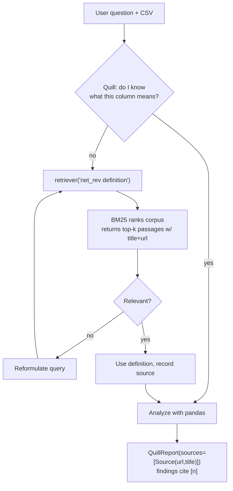

# Module 12 — Agentic RAG: Grounding Quill in a Knowledge Base

Quill from Module 11 can analyze a CSV, write pandas, save and **re-read** its charts with a VLM,
and delegate web research to `web_researcher`. But hand it a column called `net_rev` and it
**invents** the meaning from the name — "net revenue after refunds" — with total confidence and
**no source**. In your company, `net_rev` might mean something different. The number is right, the
*interpretation* is wrong, and nobody knows, because Quill cited nothing: it guessed.

This module gives Quill a **knowledge base** it queries instead of guessing:

- a **`RetrieverTool`** (`quill/retriever.py`) — a BM25 retriever over a docs corpus
  (`data/corpus/*.md`: a data dictionary + revenue/segmentation rules);
- wired into the manager's toolbox, so Quill **looks up** an ambiguous column on demand and **cites**
  the corpus doc in `QuillReport.sources` (`[n]`) — the same citation field as the web sources (M10).

This is **agentic RAG**: the retriever is a *tool the agent decides to call* (and can reformulate),
not a fixed pipeline that retrieves once before every answer.

## Agentic RAG vs the fixed pipeline

| | Fixed RAG pipeline | **Agentic RAG** (Quill) |
|---|---|---|
| Who decides to retrieve | the code (hard-wired) | the **agent** |
| When | always, once, before generating | when the agent judges it useful |
| Reformulate & retry | no | **yes** (iterative) |
| Retrievals per run | exactly 1 | 0–N |
| Predictability | high | variable |
| Fits | deterministic FAQ | analysis where the need for context varies |

Because the retriever is a tool in the ReAct loop, the agent reads the passages, judges them, and —
if they miss — **rewrites the query and retrieves again**. Named strategies like **HyDE** (search
with a hypothetical answer) and **self-query** **emerge** from this code-as-action loop; they are
*not* smolagents APIs.

> ⚠️ **Common misconception: "RAG means I must retrieve before every answer."** False for agentic
> RAG. Quill retrieves only when it needs a definition — on a question that touches no ambiguous
> column it may never call the retriever. Forcing a retrieval every turn is the fixed pipeline again
> (and a wasted call). Let the agent decide, and make the tool's **`description`** clear enough that
> it knows *when* to call it.



## The retriever is just a `Tool` (the Module 3 contract)

A `RetrieverTool` is nothing more than a `smolagents.Tool` subclass: the standard class attributes,
the BM25 index built **once in `setup()`**, and `forward(self, query) -> str` returning the formatted
passages.

```python
from smolagents import Tool

class RetrieverTool(Tool):
    name = "retriever"
    description = (
        "Looks up the project's data dictionary and domain docs to explain what a column means or "
        "how a metric is defined. Use the affirmative form, e.g. 'net_rev definition' rather than "
        "a question. If the passages do not answer you, rewrite the query and call again."
    )
    inputs = {"query": {"type": "string", "description": "What to look up in the docs."}}
    output_type = "string"
    corpus_dir = "data/corpus"   # CLASS attribute — NOT an __init__ arg (pushable, 06 §2)
    k = 5

    def setup(self):                     # lazy: runs once on the 1st call (is_initialized)
        from rank_bm25 import BM25Okapi  # import INSIDE the method (pushable rule)
        self.documents = load_corpus(self.corpus_dir)            # data/corpus/*.md
        self.index = BM25Okapi([d["text"].lower().split() for d in self.documents])
        super().setup()                  # flips is_initialized=True — so the index is built ONCE

    def forward(self, query: str) -> str:
        scores = self.index.get_scores(query.lower().split())
        top = sorted(range(len(scores)), key=lambda i: scores[i], reverse=True)[: self.k]
        return "\n\n".join(
            f"===== [{n}] {self.documents[j]['title']} ({self.documents[j]['url']}) =====\n"
            f"{self.documents[j]['text']}"
            for n, j in enumerate(top, start=1)
        )
```

- the tool's `name`/`description`/`inputs` are **baked into the system prompt at init**, so the
  `description` is what teaches the agent *when* and *how* to call it (the "building good tools"
  point, M7);
- `setup()` runs **lazily on the first `__call__`** (`is_initialized`) and never again, so the index
  is built once and reused on every `forward`. **Build it in `forward` and you re-tokenise the whole
  corpus on every query** — the headline pitfall. The final `super().setup()` is what flips
  `is_initialized` so the guard works;
- `forward`'s `query` parameter **must match the single key of `inputs`** (smolagents validates it);
- each passage embeds its `title` + `url` so the agent can map a used definition to a
  `Source(url, title)` and cite it `[n]` — grounding.

> ✅ **Pushable by construction.** No `__init__` argument beyond `self` (the corpus comes from the
> class attribute `corpus_dir`, read in `setup()`), and every import lives inside a method — the
> same discipline as `save_chart` (M3). That is what lets **Module 13** `agent.push_to_hub(...)` the
> whole Quill (tools included) without a rewrite. The official smolagents RAG example passes `docs`
> to `__init__` and uses `langchain_community.BM25Retriever`; we deviate on both — no constructor
> args (pushable) and no LangChain dependency (`rank-bm25` directly, 06 §4).

## BM25 vs embeddings

| | **BM25** (lexical, what we ship) | **embeddings** (semantic) |
|---|---|---|
| Matches on | words (TF-IDF overlap) | meaning |
| Dependencies | `rank-bm25` only | embedding model + vector store |
| Cost per query | ~0 | an embedding inference |
| Synonyms ("churn" ≈ "attrition") | **misses** | handles |
| Use when | small corpus, stable vocabulary | large corpus, varied vocabulary |

For a small, homogeneous corpus like a data dictionary, **BM25 is enough and costs nothing**. The
moment the user's words diverge from the docs' ("customer loss" vs "churn"), BM25 misses and
embeddings win. The rule of thumb: **BM25 for the demo, embeddings for prod** — not the reverse.

## Grounding: from a retrieved passage to a cited finding

Retrieving a passage is not enough — the final claim must **point to it**. That is the difference
between *"net_rev means revenue after refunds"* (guessed) and *"net_rev = net revenue, gross minus
refunds [1]"* (sourced). The retriever already returns each passage with its `title` + `url`, so the
agent builds a `Source(url=..., title=...)` and cites `[n]` in the matching finding — landing in the
**existing** `QuillReport.sources` field. **No new field** (the M8 schema is frozen); corpus sources
and web sources (M10) live in the **same** list.

When does RAG earn its keep? If the data dictionary fits in ~500 tokens, **paste it into the
`instructions`** (M7) — simpler and safer than a retriever (no risk of missing the right passage).
RAG pays when the corpus is **too big for the context**, **changes often** (update the corpus, not
the prompt), or you need **traceable citations**. RAG is not free (an index, a call, injected text);
adopt it when the context will not fit or must be sourced.

## What Module 12 adds to Quill

`quill/retriever.py` (**NEW**):

```python
class RetrieverTool(Tool): ...                    # name="retriever", BM25 over data/corpus
load_corpus(corpus_dir="data/corpus") -> list[dict]   # {title, url, text} per .md file
```

`quill/agent.py` (**MODIFIED**): `build_quill(..., retrieve: bool = True)` adds the `RetrieverTool`
to the manager's toolbox (`retrieve=False` for the pre-M12 shape). `build_retrieval_task(csv, q)`
phrases a task that nudges Quill to look up + cite an ambiguous column.

`data/corpus/` (**NEW**): `data_dictionary.md`, `revenue_policy.md`, `metrics_glossary.md`,
`segmentation.md` — citable business docs (each with a `title` + a `url`).

The retriever does its BM25 scoring in its **own** `forward` (a `Tool`, run by the framework), so
the manager's **frozen least-privilege import lock is untouched** — `rank_bm25` is NOT added to
`additional_authorized_imports`. `make_model` (BM25 calls no LLM), `QuillReport`, `save_chart`, and
`data/sales.csv` are all unchanged.

## Run it

```bash
# Quill looks up an ambiguous column in the corpus and cites it (no LLM needed for the retrieval):
uv run python -m quill "What was net_rev growth, and define net_rev precisely?" --retrieve

# The step-by-step trajectory (retriever call + any reformulation) is at:
uv run python -m quill.agent data/sales.csv "Define net_rev and report its quarterly growth."
```

## Test it

```bash
uv run pytest module-12/tests/                    # offline (no token, no network, no LLM)
QUILL_LIVE_TESTS=1 uv run pytest module-12/tests/ # + the real-model retrieve-and-cite run (needs HF_TOKEN)
```

The RAG core is **fully offline** — BM25 is purely lexical, so the `RetrieverTool` calls no LLM. The
offline tests prove, with no model and no network:

- `RetrieverTool` follows the `Tool` contract (`name`/`inputs`/`output_type`, `forward(self, query)`)
  and is **pushable** — no required `__init__` arg beyond `self`;
- `forward("net_rev definition")` returns a non-empty string that mentions **refunds** / the data
  dictionary content and carries the corpus **url + title** (the citation hook);
- the BM25 index is built **once** in `setup()` (lazy init) and reused — not rebuilt per query;
- `build_quill` carries the retriever by default and does **not** widen the frozen import lock;
- an end-to-end run where the (fake-model) manager calls `retriever(...)`, reads the definition, and
  returns a `QuillReport` whose finding cites `[1]` mapped to a corpus `Source` — and a run on a
  non-ambiguous question where the agent **never** calls the retriever (agentic = optional).

A `live` test runs the whole thing with a real model (skips cleanly without `HF_TOKEN`).

Every Module 2–11 test still passes here (the cumulative suite).

## What this module deliberately does NOT do

- **No embeddings / vector store** on the mandatory path — BM25 lexical (embeddings are a prod swap).
- **No vision** / `run(images=...)` / VLM / browser — that is Module 11 (already acquired).
- **No MCP** as the corpus source — the retriever is a home-grown `Tool`, not an MCP tool (Module 9).
- **No `GradioUI` / corpus upload / Space / CLI `smolagent`** — Module 13.
- **No telemetry / trace of the retriever span** — Module 14.
- **No eval / scoring of the citations** — Module 14 (which reuses `QuillReport`).
- **No Approach 2** (the retriever inside a remote sandbox) — Quill stays `local`; Module 15.
- **No change to `data/sales.csv` or the `QuillReport` schema** — frozen contracts.

See `lab.md` for the step-by-step. Verified against **smolagents 1.26.0**.
