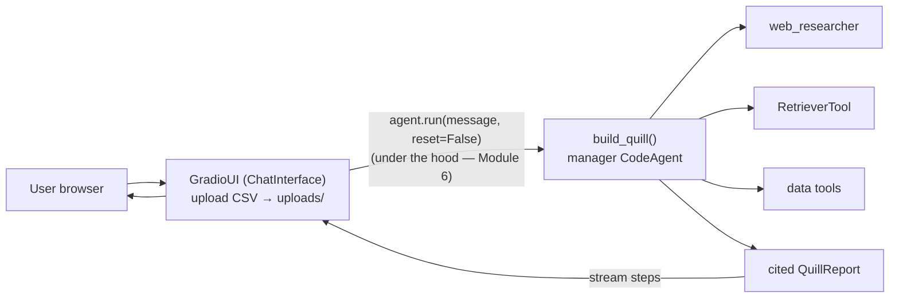
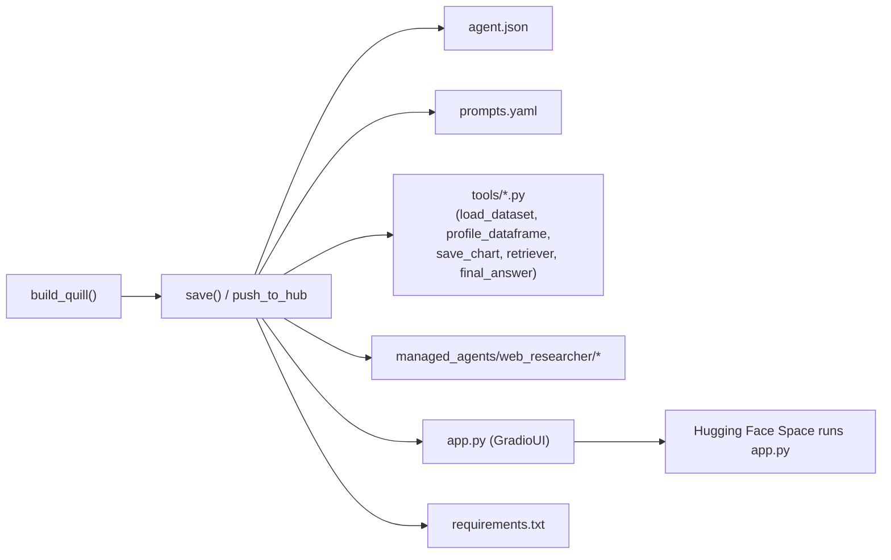

# Module 13 — Deploying Quill: Gradio UI, the Hub, and the CLI

Quill from Module 12 can analyze a CSV, write pandas, save and re-read its charts with a VLM,
delegate web research to `web_researcher`, and ground its answers in a cited knowledge base. But it
still only runs ONE way:

```bash
uv run python -m quill "Analyze data/sales.csv and chart monthly revenue"
```

That is fine for *you*. It is useless for the colleague on the sales team who has the dataset and
the question but will not clone a repo, write a `.env`, install `uv`, and type a Python command. The
best agent in the world is worthless if no one can run it.

This module turns Quill into a **product**:

- a **`GradioUI`** (`quill/ui.py`) — a chat where anyone **uploads a CSV** and asks a question, with
  multi-turn memory and streaming;
- **`push_to_hub`** (`quill/publish.py`) — serialize the WHOLE agent (tools + sub-agent + an
  `app.py`) and ship it to the Hub, where it runs as a one-click **Space**;
- the **`smolagent`** CLI — launch a generalist code agent from the terminal.

## Three lines to a web app

```python
from smolagents import GradioUI
from quill.agent import build_quill        # build_quill lives in quill/agent.py (FROZEN, 06 §2)

agent = build_quill()                       # manager + web_researcher + RetrieverTool, fully wired
GradioUI(
    agent,
    file_upload_folder="uploads",           # non-None ENABLES upload (None disables it)
    reset_agent_memory=False,               # keep the conversation going across turns
).launch()
```



Quill's UI is a `QuillGradioUI` (a tiny subclass): the ONLY change from the stock `GradioUI` is the
upload allow-list — see below.

## The CSV upload trap

`GradioUI.upload_file` defaults `allowed_file_types=[".pdf", ".docx", ".txt"]` (as of smolagents
1.26.0) — **`.csv` is not in it**. So a vanilla `GradioUI` REFUSES a CSV upload, which is backwards
for a data analyst. `QuillGradioUI` widens the list to `[".csv", ".parquet", ".xlsx"]`:

```python
QUILL_ALLOWED_FILE_TYPES = [".csv", ".parquet", ".xlsx"]
```

Once uploaded, Gradio writes the file into `file_upload_folder` and appends its PATH to the
conversation, so Quill's frozen `load_dataset(path)` (M3) reads it. The upload deposits a FILE; it
does **not** inject a DataFrame.

## Why the chat remembers: `reset=False`

With `reset_agent_memory=False`, the UI runs each new message as `agent.run(message, reset=False)` —
the OPPOSITE of `agent.run`'s own default (`reset=True`, which wipes memory). That is what makes a
chat a chat: Quill keeps the uploaded DataFrame and prior questions.

| | `reset=True` (script one-shot) | `reset=False` (UI / chat) |
|---|---|---|
| Memory at run start | wiped | kept |
| Use case | one-shot analysis | multi-turn chat |
| Who sets it | you, in a script | `GradioUI`, automatically |
| Cost over turns | bounded | grows each turn → prune (M6) |

> ⚠️ **Common misconception: "`reset_agent_memory=False` / `reset=False` makes the agent re-think
> from scratch / forget context."** It is the INVERSE — `reset=False` KEEPS the context. The memory
> (and the cost) grow each turn, which is exactly why you prune with `step_callbacks` (Module 6).

For a custom app, `build_custom_app(agent)` drives the agent with **`stream_to_gradio`** and wires a
**Stop** button to **`agent.interrupt()`** — which stops the agent **at the end of its current
step**, then raises (NOT mid-LLM-call). A Stop button is a minimal guard for a public agent.

## Shipping the agent: what `save()` / `push_to_hub` serialize

`MultiStepAgent.push_to_hub(repo_id, commit_message="Upload agent", private=None, token=None,
create_pr=False)` uploads the whole agent; `save(output_dir)` writes the same files locally:



- `managed_agents/` is present ONLY because Quill is multi-agent (`web_researcher`); a solo agent
  would have none.
- **`app.py`** is the load-bearing one: a ready-to-run `GradioUI` over the reloaded agent — it makes
  the repo run as a **Space** with nothing else added.
- (smolagents 1.26.0 writes `prompts.yaml`; older docs call it `prompt.yaml` — same file.)

### The pushable friction (the agent-level T3.15)

`save()`/`push_to_hub` only succeed if **every** tool is "pushable": all imports inside the tool's
functions, `__init__` with no argument beyond `self`, and each tool body references no module-level
helper (the saved tool carries only its own source). This module HARDENED Quill's FROZEN tools to
meet that — **without changing their signatures, prints, or error messages**:

| Tool | Was | Now (pushable) |
|---|---|---|
| `load_dataset` / `profile_dataframe` | called module-level `_read_table`; used generator expressions in `join` | read-table body **inlined**; **list** comprehensions |
| `RetrieverTool` | `corpus_dir = DEFAULT_CORPUS_DIR`; `setup()` called `load_corpus` | **literal** `corpus_dir = "data/corpus"`; corpus walk **inlined** |

`save_chart` was already pushable (M3/M9). The static validator (`Tool.to_dict`) reads only each
tool's own source, which is why a single outside reference (`_read_table`, `load_corpus`) or a
non-literal class attribute made `agent.save` raise.

> ⚠️ A pushed agent **publishes its tool code**. Never embed a secret in a tool; the token comes
> from `.env` (`HF_TOKEN`), never hard-coded. Use `--private` for a private repo.

## Loading it back: `from_hub` and `trust_remote_code`

```python
from smolagents import CodeAgent
agent = CodeAgent.from_hub("user/quill", trust_remote_code=True)
```

`from_hub` is a **classmethod** (prefer the class form over `agent.from_hub(...)`).
**`trust_remote_code=True` is MANDATORY** — `from_hub` downloads and **executes remote tool code**,
so `False` (the default) refuses to run it. Inspect the repo before you trust it (the same warning as
the MCP `trust_remote_code` of M9). `from_folder(folder)` / `from_dict(agent_dict)` are the local
equivalents; deserialization is gated by `AGENT_REGISTRY` (`"CodeAgent"`/`"ToolCallingAgent"` →
classes). Because the push shipped an `app.py`, the repo runs as a **Space** with no extra config.

## The CLI: `smolagent` vs `webagent`

| Name | Entry point | Agent type | Default model | Use |
|---|---|---|---|---|
| **`smolagent`** | `smolagents.cli:main` | generalist `CodeAgent` | InferenceClientModel + Qwen3-Next-* | a code agent from flags |
| **`webagent`** | `smolagents.vision_web_browser:main` | vision browser (helium/Chrome) | `gpt-4o` via LiteLLM | drive a real browser |

```bash
smolagent "Which sales category grew fastest last quarter?" \
  --model-type "InferenceClientModel" --model-id "Qwen/Qwen2.5-Coder-32B-Instruct" \
  --imports "pandas numpy"
```

`smolagent` builds a **generic** agent from the flags — it does NOT resurrect the rich `build_quill`
(manager + retriever + sub-agents). For the real Quill from the terminal, use `python -m quill`
(one-shot) or `python -m quill --ui` (web app).

## What Module 13 adds to Quill

`quill/ui.py` (**NEW**): `make_ui(agent)` / `QuillGradioUI` (CSV upload), `launch_ui(share=False)`,
`build_custom_app(agent)` (Stop button via `stream_to_gradio` + `agent.interrupt()`).

`quill/publish.py` (**NEW**): `save_quill_locally(dir)` (offline), `publish_quill(repo_id, private=)`
(`push_to_hub`), `reload_from_hub(repo_id, trust_remote_code=True)` (`from_hub`),
`EXPECTED_ARTIFACTS`.

`app.py` (**NEW**, repo root): the Space entry point — delegates to `quill.ui.launch_ui` (which calls
`build_quill()`).

`quill/__main__.py` (**MODIFIED**): `python -m quill --ui` launches the web app; the one-shot path is
unchanged.

`quill/tools/data.py` + `quill/retriever.py` (**hardened for pushability** — frozen signatures,
prints and errors **unchanged**). `uploads/` (**NEW**, the upload folder). `build_quill`,
`make_model`, `QuillReport`, `save_chart`, `data/sales.csv` are all unchanged.

## Run it

```bash
uv pip install 'smolagents[gradio]'                    # gradio>=5.14.0 (as of smolagents 1.26.0)

uv run python -m quill.ui                              # web app (local; --share for a public tunnel)
uv run python app.py                                   # the Space entry point (same UI)
uv run python -m quill.publish --repo "<user>/quill"   # push to the Hub as a Space (needs HF_TOKEN)
uv run python -m quill.publish --save-dir build/quill  # serialize locally (OFFLINE — the 6 artefacts)
```

## Test it

```bash
uv run pytest module-13/tests/                          # offline (no token, no network, no .launch())
QUILL_LIVE_TESTS=1 uv run pytest module-13/tests/ -m live  # the REAL push_to_hub/from_hub round-trip
```

The deploy core is **fully offline**. The tests construct the `GradioUI` but **never** launch it
(no server, no port), and prove with no network:

- `make_ui(agent)` returns a `GradioUI` that wraps the SAME agent, with `file_upload_folder="uploads"`
  and `reset_agent_memory=False`, and accepts a `.csv` the stock default would reject;
- `stream_to_gradio` / `agent.interrupt()` are wired in `build_custom_app` (built, not launched);
- `agent.save(tmp)` writes the 6 artefacts (`agent.json`, `prompts.yaml`, `tools/`, `managed_agents/`,
  `app.py`, `requirements.txt`) — `managed_agents/` because Quill has a sub-agent;
- every Quill tool is individually pushable (`to_dict()` succeeds — the M13 hardening);
- `from_folder` round-trips the whole multi-agent Quill, `from_dict` round-trips a solo Quill (a real
  `InferenceClientModel` is constructed but never called);
- `from_hub` requires `trust_remote_code=True` (default `False`); `smolagent` and `webagent` are
  distinct importable entry points; the CLI defaults match 1.26.0.

A `live` test does the real Hub push + `from_hub` reload (skips cleanly without `HF_TOKEN`). Every
Module 2–12 test still passes here (the cumulative suite).

## What this module deliberately does NOT do

- **No telemetry / traces** (`SmolagentsInstrumentor`) — Module 14.
- **No eval harness** (golden set, LLM-as-judge, TSR) — Module 14.
- **No production hardening** (timeouts, step caps, retries) or full prod checklist — Module 15.
- **No Approach 2** (the whole agent inside a remote sandbox) — the UI runs `local` here; Module 15.
- **No `webagent`** beyond the one-line distinction with `smolagent` (vision is Module 11).
- **No `QuillReport` schema change** and **no tool-signature change** — the UI consumes the existing
  agent; the pushable hardening kept all signatures/prints/errors byte-for-byte.
- **No agent reconstruction outside `quill/agent.py`** — `ui.py`/`app.py`/`publish.py` call
  `build_quill()`.

See `lab.md` for the step-by-step. Verified against **smolagents 1.26.0**.
