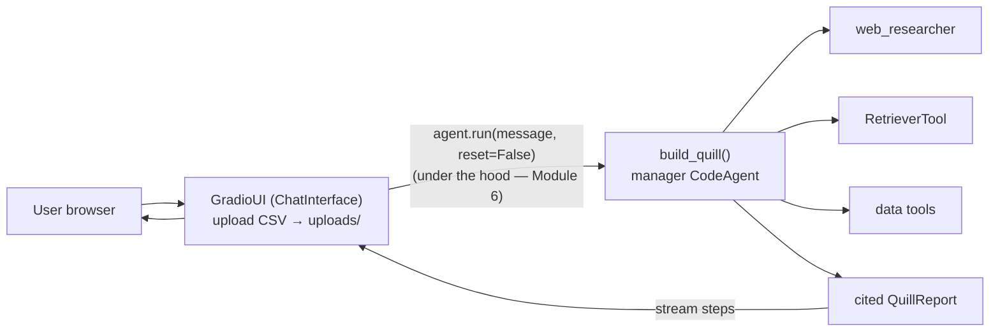
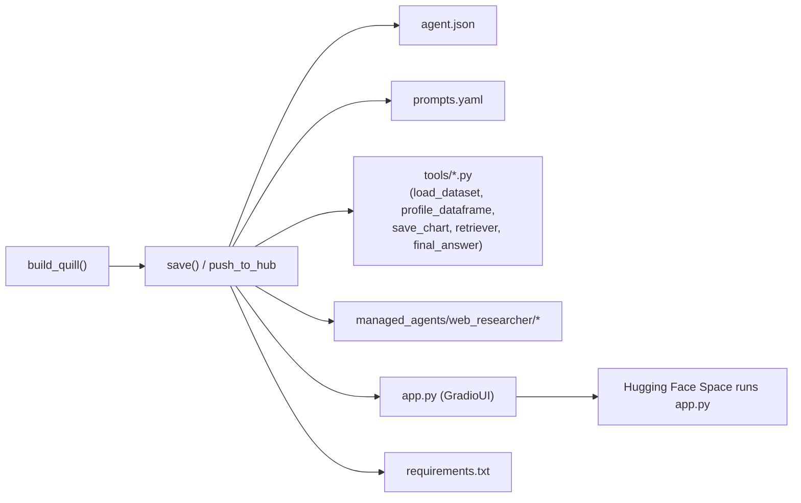

# Lab 13 — Deploying Quill: a Gradio web app, a Hub Space, and the CLI

**Goal:** turn Quill from a script into a **product**. Wrap the full Quill (manager +
`web_researcher` + `RetrieverTool`) in a **`GradioUI`** with **CSV upload** and multi-turn memory,
**push the whole agent to the Hub** (`push_to_hub`) so it runs as a one-click **Space**, and launch
a generalist agent from the **`smolagent`** CLI.

**You'll see:** `GradioUI(agent, file_upload_folder="uploads", reset_agent_memory=False)` — a web app
in three lines; why the UI keeps memory (it runs `agent.run(..., reset=False)` under the hood — M6);
the CSV upload trap (the stock `allowed_file_types` is `[".pdf",".docx",".txt"]`, with **no `.csv`** —
you must widen it); exactly what `save()`/`push_to_hub` serialize (`agent.json`, `prompts.yaml`,
`tools/`, `managed_agents/`, **`app.py`**, `requirements.txt`); the **pushable** friction (every tool
must be self-contained, or `save()` raises); reloading with `CodeAgent.from_hub(repo,
trust_remote_code=True)`; and `smolagent` (generalist CodeAgent) vs `webagent` (vision browser).

**Observable result:**

```bash
uv run python -m quill.ui            # or: uv run python app.py   (--share for a public tunnel)
```

→ opens a Gradio chat. Drop `data/sales.csv` via the uploader, type *"Chart monthly revenue and
tell me which category grew fastest"* — Quill streams its steps and returns a cited `QuillReport`
with the chart. A second message (*"now break that down by region"*) shows the memory persists
(`reset=False`). Then:

```bash
uv run python -m quill.publish --repo "<your-user>/quill"   # push_to_hub: ship it as a Space
```

→ writes `agent.json`, `prompts.yaml`, `tools/*.py`, `managed_agents/web_researcher/*`, `app.py`,
`requirements.txt` to the Hub repo; it now runs as a Space. And:

```bash
smolagent "Which sales category grew fastest last quarter?" \
  --model-type "InferenceClientModel" --model-id "Qwen/Qwen2.5-Coder-32B-Instruct" \
  --imports "pandas numpy"
```

→ a generalist CodeAgent answers from the terminal (the standard smolagents CLI path).

---

## 0. Setup

You start from the cumulative Module 12 Quill (manager + `web_researcher` + `RetrieverTool`,
returning a cited `QuillReport`). Add the UI extra:

```bash
uv sync
uv pip install 'smolagents[gradio]'   # gradio>=5.14.0, as of smolagents 1.26.0
```

Set `HF_TOKEN` (WRITE scope) in `.env` — required for the Hub push and `from_hub`. Quill still runs
in `executor_type="local"` here; a *public* agent must run in a remote sandbox (Approach 2 — Module
15), never in `local`.

## 1. `quill/ui.py` — three lines to a web app (T12.1)

`make_ui(agent)` wraps the agent in a `QuillGradioUI`:

```python
from smolagents import GradioUI
from quill.agent import build_quill        # build_quill lives in quill/agent.py (FROZEN, 06 §2)

def make_ui(agent=None, *, file_upload_folder="uploads", reset_agent_memory=False):
    if agent is None:
        agent = build_quill()               # the ONLY place Quill is constructed — never rebuilt here
    return QuillGradioUI(agent, file_upload_folder=file_upload_folder,
                         reset_agent_memory=reset_agent_memory)
```

- **`file_upload_folder="uploads"`** — non-`None` ENABLES upload (with `None`, upload is disabled).
- **`reset_agent_memory=False`** — keep memory across turns (see step 2).
- **The CSV trap (the concrete point of T12.1):** `GradioUI.upload_file` defaults
  `allowed_file_types=[".pdf",".docx",".txt"]` — **`.csv` is not in it**, so a vanilla `GradioUI`
  REFUSES a CSV. `QuillGradioUI` overrides `upload_file` to use `[".csv",".parquet",".xlsx"]`. Once
  uploaded, Gradio writes the file into `uploads/` and adds its PATH to the conversation, so Quill's
  frozen `load_dataset(path)` (M3) reads it. The upload deposits a FILE; it does not inject a
  DataFrame.



Launch it (no public tunnel by default):

```bash
uv run python -m quill.ui          # share=False
uv run python -m quill.ui --share  # also open a temporary *.gradio.live tunnel
```

## 2. Why the chat remembers: `reset=False`, streaming, the Stop button (T12.2)

With `reset_agent_memory=False`, the UI runs each new message as `agent.run(message, reset=False)` —
the OPPOSITE of `agent.run`'s own default (`reset=True`, which wipes memory). That is what makes a
chat a chat: Quill keeps the uploaded DataFrame and prior questions.

> ⚠️ **Common misconception: "`reset_agent_memory=False` / `reset=False` makes Quill re-think from
> scratch / forget."** It is the INVERSE — `reset=False` KEEPS the context. The memory (and the
> cost) grow each turn, which is exactly why you prune with `step_callbacks` (Module 6).

| | `reset=True` (script one-shot) | `reset=False` (UI / chat) |
|---|---|---|
| Memory at run start | wiped | kept |
| Use case | one-shot analysis | multi-turn chat |
| Who sets it | you, in a script | `GradioUI`, automatically |
| Cost over turns | bounded | grows each turn → prune (M6) |

The OPTIONAL `build_custom_app(agent)` shows the lower-level path (the "Try it yourself"): drive the
agent with **`stream_to_gradio`** (it runs `agent.run(..., stream=True)` and yields Gradio messages
as steps land) and wire a **Stop** button to **`agent.interrupt()`** — which stops the agent **at the
end of its current step**, then raises (NOT mid-LLM-call). A Stop button is a minimal guard for a
public agent.

## 3. Ship it: `save()`, `push_to_hub`, the `app.py` Space (T12.3)

`MultiStepAgent.push_to_hub(repo_id, commit_message="Upload agent", private=None, token=None,
create_pr=False)` uploads the whole agent. `save(output_dir)` writes the same files locally:



`managed_agents/` is there ONLY because Quill is multi-agent (`web_researcher`); a solo agent would
have none. **`app.py`** is the load-bearing one: a ready-to-run `GradioUI` over the reloaded agent —
it is what makes the repo run as a **Space** with nothing else added. (smolagents 1.26.0 writes
`prompts.yaml`; older docs call it `prompt.yaml` — same file.)

**The pushable friction (T3.15, at the agent level).** `save()`/`push_to_hub` only succeed if EVERY
tool is "pushable": all imports inside the tool's functions, `__init__` with no argument beyond
`self`, AND each tool body references no module-level helper (the saved tool carries only its own
source). This module HARDENED Quill's FROZEN tools to meet that — without changing their signatures,
prints or error messages:

- `load_dataset` / `profile_dataframe` **inline** their read-table body (no shared `_read_table`
  call — `to_dict()` rejected it: *"Name '_read_table' is undefined"*), and use **list**
  comprehensions, not bare generator expressions (the validator does not track generator-expr
  targets).
- `RetrieverTool` uses **literal** class attributes (`corpus_dir = "data/corpus"`, `k = 5` — a
  non-literal class attribute trips *"Complex attributes should be defined in __init__"*) and
  **inlines** its corpus walk in `setup()` (no `load_corpus` call).

Push it (never embed a secret in a tool — a public agent publishes its tool code; use `--private`
for a private repo):

```bash
uv run python -m quill.publish --repo "<your-user>/quill"             # push
uv run python -m quill.publish --repo "<your-user>/quill" --private   # push privately
uv run python -m quill.publish --save-dir build/quill                 # save locally (OFFLINE)
```

## 4. Load it back: `from_hub` and `trust_remote_code` (T12.4)

```python
from smolagents import CodeAgent
agent = CodeAgent.from_hub("<your-user>/quill", trust_remote_code=True)
```

`from_hub` is a **classmethod** (prefer `CodeAgent.from_hub(...)` over `agent.from_hub(...)`).
**`trust_remote_code=True` is MANDATORY** — `from_hub` downloads and **executes remote tool code**,
so `False` (the default) refuses to run it. Inspect the repo before you trust it (the same warning
as the MCP `trust_remote_code` of M9; many tutorials paste `True` without explaining it).
`from_folder(folder)` / `from_dict(agent_dict)` are the local equivalents; deserialization is gated
by `AGENT_REGISTRY` (it maps `"CodeAgent"`/`"ToolCallingAgent"` to the classes). Because
`push_to_hub` shipped an `app.py`, the repo runs as a **Space** (a chat) with no extra config; for a
programmatic API, host the Gradio app (Gradio exposes a REST/queue API) or wrap `agent.run(...)` in
your own server.

## 5. The CLI: `smolagent` vs `webagent` (T12.5)

```bash
smolagent "Which sales category grew fastest last quarter?" \
  --model-type "InferenceClientModel" --model-id "Qwen/Qwen2.5-Coder-32B-Instruct" \
  --imports "pandas numpy" --tools "web_search"
```

`smolagent` (entry point `smolagents.cli:main`) is a generalist multi-step **CodeAgent**; run it with
no prompt for interactive mode. Defaults (as of smolagents 1.26.0): `--model-type
"InferenceClientModel"`, `--model-id "Qwen/Qwen3-Next-80B-A3B-Thinking"` (⚠️ volatile, subject to
change — pass an explicit coder model), `--action-type "code"`, `--tools ["web_search"]`,
`--imports []`, `--verbosity-level 1`.

| Name | Entry point | Agent type | Default model | Use |
|---|---|---|---|---|
| **`smolagent`** | `smolagents.cli:main` | generalist `CodeAgent` | InferenceClientModel + Qwen3-Next-* | a code agent from flags |
| **`webagent`** | `smolagents.vision_web_browser:main` | vision browser (helium/Chrome) | `gpt-4o` via LiteLLM | drive a real browser |

⚠️ Honesty: `smolagent` builds a **generic** agent from the flags — it does NOT resurrect the rich
`build_quill` (manager + retriever + sub-agents). To launch the *real* Quill from the terminal, keep
using `python -m quill` (one-shot) or `python -m quill --ui` (web app). And the default `--model-id`
burns the HF free tier ($0.10/month, as of smolagents 1.26.0, subject to change) — pass an explicit
model and a free/local provider when you can.

## 6. Tests

```bash
uv run pytest module-13/tests -q          # offline (sandbox/live skip; needs Docker / QUILL_LIVE_TESTS)
QUILL_LIVE_TESTS=1 uv run pytest module-13/tests -q -m live   # real push_to_hub/from_hub (needs HF_TOKEN)
```

The offline tests **never** launch the UI (no server, no port): they construct `GradioUI` and assert
it wraps the agent, carries `file_upload_folder="uploads"` / `reset_agent_memory=False`, and accepts
a `.csv`. The serialization test runs `agent.save(tmp_path)` OFFLINE and asserts the 6 artefacts;
`from_folder`/`from_dict` round-trip offline (a real `InferenceClientModel` is constructed but never
called). Only the real Hub round-trip is `live` (skipped without `QUILL_LIVE_TESTS=1`; skips cleanly
without `HF_TOKEN`).

## Try it yourself

1. Build a custom Gradio app with `build_custom_app` (a Stop button wired to `agent.interrupt()` via
   `stream_to_gradio`) and watch it stop at the end of the current step.
2. Reload your pushed Quill with `CodeAgent.from_hub("<your-user>/quill", trust_remote_code=True)`,
   ask the same question, and confirm it answers like the local one. Inspect the `app.py` the Hub
   received.

## What this lab does NOT do (deferred)

- No **telemetry**/traces and no **eval harness** (TSR, LLM-as-judge) — Module 14.
- No production **hardening** (timeouts, step caps, retries) or full prod checklist — Module 15.
- No **Approach 2** (the whole agent inside a remote sandbox) — the UI runs `local` here; Module 15.
- No `QuillReport` schema change and no tool-signature change — the UI consumes the existing agent.
- No agent reconstruction outside `quill/agent.py` — `ui.py`/`app.py`/`publish.py` all call
  `build_quill()`.
