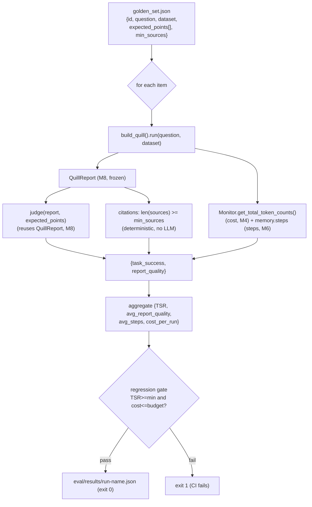

# Module 14 — Observability and Evaluation: Is Quill Any Good?

Quill from Module 13 is **deployed**: it runs behind a `GradioUI`, ships to the Hub as a Space, and
launches from the `smolagent` CLI. It *works*. But nobody knows if it is *good*. When a run goes
sideways there is no readable trace to open, and "it looks like it works" is the only measure of
quality — no metrics, no detectable regression, no cost/run tracked.

This module gives Quill two things it was missing:

- **eyes** — **telemetry**: every run becomes an inspectable OpenTelemetry trace
  (`quill/telemetry.py`), sent to **Langfuse** or **Arize Phoenix** from a single instrumentor;
- **a grade** — an **eval harness** (`quill/eval/`): a frozen golden set, an **LLM-as-judge** that
  scores a `QuillReport`, a **Task Success Rate (TSR)**, a **cost/run**, and a **regression gate**.

"It looks like it works" becomes defensible numbers.

## Give Quill eyes: tracing in one line

**OpenTelemetry** is the vendor-neutral standard for traces; **OpenInference** (maintained by Arize)
ships the instrumentor that turns smolagents' spans on. The call is backend-agnostic:

```python
from openinference.instrumentation.smolagents import SmolagentsInstrumentor
SmolagentsInstrumentor().instrument()   # BEFORE you build/run the agent
```

The import is `openinference.instrumentation.smolagents` — **not** `from smolagents import ...`. And
the ordering is the whole point: **`instrument()` must run BEFORE `build_quill(...)`**, or the first
steps' spans are already gone. Quill's entry point (`quill/__main__.py`) calls
`telemetry.instrument()` first; with `QUILL_TELEMETRY=none` (the default) that is a clean no-op, so a
run with no backend is never broken.

```python
# quill/telemetry.py
instrument(backend=None)   # reads QUILL_TELEMETRY ∈ {none, langfuse, phoenix}; default none -> no-op
```

| Backend | Where it runs | Setup | Persistence | Same instrumentor? |
|---|---|---|---|---|
| **Langfuse** | cloud or self-host | `LANGFUSE_*` env keys + `get_client().auth_check()` | yes | yes |
| **Arize Phoenix** | local | `python -m phoenix.server.main serve` + `phoenix.otel.register()` | yes | yes |
| **MLflow** | local | `mlflow.smolagents.autolog()` (one line) | yes | autolog (not the instrumentor) |
| **in-process** (`replay`) | none | nothing (`agent.replay()` / `agent.memory.steps`) | no (process memory) | n/a |

A trace is a tree of **spans**: a root span (the run), an LLM span per model call, a tool span per
tool call. For Quill's team the **`web_researcher` span is a CHILD of the manager span** — nested
spans, the only sane way to read a multi-agent run. Before any backend, smolagents already gives you
in-process inspection: `agent.memory.steps`, `agent.replay()`, `agent.visualize()` — **never** the
removed `agent.logs` (gone in 1.21.0).

> ⚠️ **Common misconception: "telemetry slows my agent / I'll add it later."** Wrong both ways.
> OTel export is near-free (asynchronous); and "later" means you have no trace the moment a prod run
> breaks. Worse: if you don't call `instrument()` **before** building the agent, the first spans are
> never captured. (Telemetry semantic conventions are still evolving as of smolagents 1.26.0.)

## Outcome vs trajectory: what to measure

Two families of metrics:

- **outcome** — did Quill reach the goal? (is the answer right?) → **Task Success Rate (TSR)**.
- **trajectory** — *how* it got there (how many steps, which tools, in what order) → **tool-call
  accuracy**, **trajectory efficiency**, **cost/run**.

A run that returns the right answer in 18 steps when 4 would do is an outcome pass with a trajectory
problem. The trace **is** the trajectory made readable. Public benchmarks — **GAIA** (general
assistants; Open Deep Research reports **55.15% GAIA**, as of smolagents 1.26.0), **SWE-bench
Verified** (coding), **WebArena** (web automation) — measure *generalist* agents. A *domain* agent
like Quill doesn't run GAIA; it builds its own **golden set**.

| Metric | Family | What you do with it | Where you read it |
|---|---|---|---|
| Task Success Rate | outcome | validate (does it answer?) | judge / asserts |
| tool-call accuracy | trajectory | debug (right tools, right args?) | trace / spans |
| trajectory efficiency | trajectory | debug (redundant steps?) | `memory.steps` / spans |
| cost/run | trajectory | budget (tokens × price) | `Monitor` (M4) |

## The judge: scoring a `QuillReport` without it grading itself

A quality outcome ("is this report good?") has no exact answer → an **LLM-as-judge** scores it
against an explicit rubric. Four non-negotiable rules:

1. **Explicit rubric** — numeric criteria, not "rate this 1-10". The judge scores three axes 0-2
   (max 6): coverage of `expected_points`, grounding of findings, citations `[n]`.
2. **Evidence-before-score** — the judge writes its `rationale` FIRST, then the `scores`.
3. **Structured output** — parsable JSON `{rationale, scores{...}, verdict}`, not prose (the same
   spirit as M8's `response_format`).
4. **Calibration** — compare the judge's scores to YOUR human labels (~0.80 correlation as an order
   of magnitude, as of smolagents 1.26.0). A judge you never calibrated measures its own bias.

The judge takes the **FROZEN `QuillReport`** (M8) as input and never modifies it — the same schema
M8 validates at run time (`final_answer_checks`) is scored a posteriori here. **One schema, used
twice.** The judge is a **SEPARATE `make_model` call** (06 §2: one model factory for Quill AND the
judge), ideally a different/stronger model (`QUILL_JUDGE_MODEL_ID`) — **never let an agent grade
itself.** This is Anthropic's evaluator-optimizer pattern, composed by hand (not a smolagents
primitive). **Agent-as-a-judge** (arXiv 2508.02994) extends this to score the whole *trajectory* —
concept only here.

## The eval harness: golden set, cost/run, and a regression gate



The frozen format (06 §2 — Module 15 reuses these keys verbatim):

```text
golden_set.json = [{id, question, dataset, expected_points[], min_sources}]
run-<name>.json = {run_name, model,
                   scores: [{id, task_success, report_quality, citations, steps, cost}],
                   aggregate: {TSR, avg_report_quality, avg_steps, cost_per_run}}
```

| Score | Measures | Family | How computed | In the gate? |
|---|---|---|---|---|
| `task_success` | covers `expected_points`? | outcome | the **judge** | yes (TSR) |
| `report_quality` | rubric total /6 | outcome | the **judge** | no |
| `citations` | `len(sources) >= min_sources` | outcome | **deterministic, no LLM** | no |
| `steps` | trajectory length | trajectory | `memory.steps` action steps (M6) | no |
| `cost` | tokens this run | trajectory | `Monitor.get_total_token_counts()` (M4) | yes (cost/run) |

The **regression gate** compares the aggregate to `QUILL_EVAL_MIN_TSR` (default 0.70) and
`QUILL_EVAL_MAX_COST` (a per-run token budget, off by default) and **exits non-zero** when either
fails — so a "small prompt tweak" that drops TSR or bumps cost 40% is caught BEFORE you deploy.
Compare `run-baseline.json` vs `run-candidate.json` to see the regression.

Cost/run is not cosmetic: one eval run = N Quill runs + N judge calls (the judge ALSO costs tokens),
and the HF free tier is ~$0.10/month (as of smolagents 1.26.0, subject to change). Scope (deferred to
M15): the eval runs on the current `QUILL_EXECUTOR` (no forced remote sandbox) and does not harden
Quill.

## What Module 14 adds to Quill

`quill/telemetry.py` (**NEW**): `instrument(backend=None)` — `SmolagentsInstrumentor().instrument()`
for Langfuse/Phoenix (driven by `QUILL_TELEMETRY`), a clean no-op when `none`. `resolve_backend`.

`quill/eval/` (**NEW**): `golden_set.json` (FROZEN format), `run_evals.py` (the harness CLI + the
`run_evals` / `evaluate_item` / `aggregate_scores` / `apply_regression_gate` functions),
`judge.py` (the LLM-as-judge over `QuillReport`), `results/` (gitignored run outputs).

`quill/__main__.py` (**MODIFIED**): calls `telemetry.instrument()` BEFORE building Quill.

`quill/config.py` (**MODIFIED, additive**): `make_model` accepts an optional `model_id` override so
the judge can point at a separate model — every prior call site is unchanged.

`quill/agent.py`, `quill/report.py` (`QuillReport`), `build_quill`, `save_chart`, `data/sales.csv`
are all **UNCHANGED** — telemetry and eval live in their own modules, around the agent.

## Run it

```bash
uv pip install 'smolagents[telemetry]==1.26.0'        # arize-phoenix + otel + the OpenInference instrumentor
# (Langfuse-only: pip install openinference-instrumentation-smolagents langfuse)

# Trace a run (open the trace in Langfuse/Phoenix; spans nest manager -> web_researcher):
QUILL_TELEMETRY=phoenix uv run python -m quill "Which category grew fastest?" --data data/sales.csv

# Score Quill behind the regression gate (exit 0 on pass, non-zero on a regression):
uv run python -m quill.eval.run_evals --out eval/results/run-baseline.json
```

Expected summary:

```text
Golden set: 5 tasks · model=Qwen/Qwen2.5-Coder-32B-Instruct
TSR: 0.80 (4/5)  ·  avg report_quality: 4.6/6  ·  avg steps: 6.2  ·  cost/run: ~12.4k tokens
Regression gate: PASS (TSR>=0.70, cost/run no cap)
```

## Test it

```bash
uv run pytest module-14/tests/                            # offline (no token, no network, no backend)
QUILL_LIVE_TESTS=1 uv run pytest module-14/tests/ -m live # ONE real golden-set item (Quill + judge)
```

The telemetry + eval core is **fully offline**, and proves with no network:

- `telemetry.instrument()` is a clean no-op with `QUILL_TELEMETRY=none`; `resolve_backend` rejects an
  unknown value; the instrumentor imports from `openinference.instrumentation.smolagents`; the entry
  point instruments BEFORE building the agent;
- the golden set is the frozen `{id, question, dataset, expected_points[], min_sources}` shape;
- the judge takes a `QuillReport`, uses a numeric rubric with rationale-before-scores, and returns
  structured JSON — driven by a fake judge model (no self-grading);
- `citations` is deterministic (no LLM); `run_evals` produces the frozen results dict + aggregate on
  a fake-model Quill + fake judge; the gate exits non-zero when TSR/cost crosses a threshold;
- `steps` via `memory.steps`, `cost` via `Monitor.get_total_token_counts()` — never `agent.logs`.

A `live` test runs ONE real golden item end to end (skips cleanly without `HF_TOKEN`). Every Module
2–13 test still passes here (the cumulative suite).

## What this module deliberately does NOT do

- **No production hardening** (timeouts, step caps, bounded retries) or **Approach 2** (the whole
  agent inside a remote sandbox) — the eval runs on the current `QUILL_EXECUTOR`; that is Module 15.
- **No re-deployment** (`push_to_hub` / `GradioUI` / CLI) — Module 13; we instrument the existing
  agent, we don't re-deploy it.
- **No Agent-as-a-judge** implemented (concept only; the lab does an LLM-as-judge on the output).
- **No public benchmark** (GAIA/SWE-bench/WebArena) executed — they are conceptual references.
- **No `QuillReport` schema change** and **no `quill/report.py` / `build_quill` change** — telemetry
  and eval add around the agent, not inside it.
- **No mandatory automated human calibration** (documented + optional); **no custom dashboard** (the
  traces live in Langfuse/Phoenix).

See `lab.md` for the step-by-step. Verified against **smolagents 1.26.0**.
