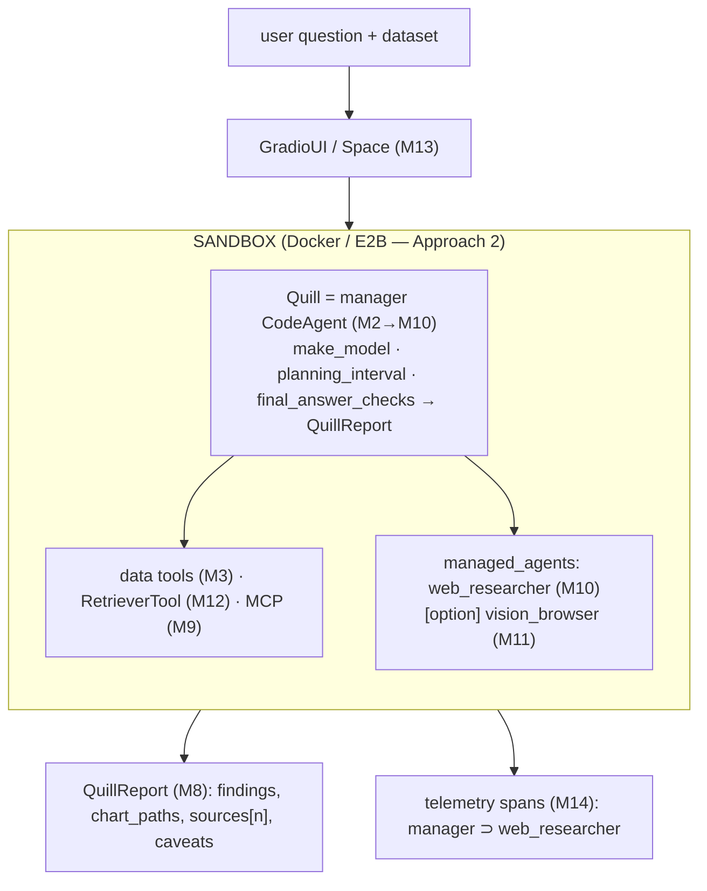

# Module 15 — Capstone: Ship Quill, a Production-Grade Code Agent (v1.0)

Fourteen modules in, Quill *works* — but look closely and it is **complete but scattered**: the
multi-agent team still runs in `executor_type="local"`, which is **not a sandbox** (Module 5); there
is no retry cap, so a looping sub-agent can quietly burn the free tier; two identical runs can
re-write the same chart and double-count the cost. That is the gap between "runs on my laptop" and
"I can hand it to someone else." And the missing piece bites hard: you want a sandbox's isolation
**and** your multi-agent team — but in smolagents 1.26.0, a remote `executor_type` together with
`managed_agents` **raises an exception**.

This capstone **assembles and hardens** what the previous fourteen modules built — it adds **no new
feature**. It wires everything into one runnable system, switches the team to **Approach 2** (the
whole system *inside* a sandbox), hardens it, keeps telemetry + the eval gate on, and tags **`v1.0`**.

> **Quill is v1.0.** Quill is now a system you can defend: its multi-agent team runs inside a
> hardened sandbox (Approach 2), it is bounded (step caps, retries ≤ 2, idempotent outputs),
> observable (OpenTelemetry on), and gated by evals (green or no ship). The repo is tagged `v1.0`.

## The last missing piece: run the whole team inside a sandbox (Approach 2)

`local` is an AST allow-list, not a security boundary — the library says so: *"it is not a security
sandbox."* So why not just set `QUILL_EXECUTOR=docker`? Because a remote executor + `managed_agents`
raises, verified in `smolagents/agents.py::create_python_executor` (1.26.0):

```python
if self.managed_agents:
    raise Exception("Managed agents are not yet supported with remote code execution.")
```

That is **Approach 1** (snippet-in-sandbox): the model/agent stay local, only generated Python
snippets go to the container, and **secrets never enter the box** — so a sub-agent could not
authenticate its own LLM from inside. Approach 1 therefore **cannot do multi-agent**.

| | **Approach 1** (snippet-in-sandbox) | **Approach 2** (whole system in the sandbox) |
|---|---|---|
| What runs in the sandbox | the generated Python snippets only | the entire agent + sub-agents |
| Multi-agent supported | **No** (raises the exception above) | **Yes** |
| Effort | one parameter (`executor_type="docker"`) | create the sandbox by hand, run the agent inside |
| Secrets in the sandbox | No (model stays local) | sometimes yes (`HF_TOKEN` passed as env) |
| Quill's case | M5 demo (solo agent) | **M15 capstone (the team)** |

**Approach 2** is what the capstone implements (`quill/runtime.py`): create a hardened Docker
container (or an E2B sandbox) **by hand**, copy the `quill` package + `data/` in, pass `HF_TOKEN` as
a container env var, and run `build_quill(...).run(...)` **inside** the container. The manager AND
its sub-agents now execute in the sandbox; only the question (in) and the cited `QuillReport` (out)
cross the boundary.



> Approach 2 is **not** an `executor_type` — there is no `executor_type="approach2"`. You build the
> sandbox yourself. And `executor_type="wasm"` was **removed** in 1.26.0; valid values are
> `{local, docker, e2b, modal, blaxel}`.

The Docker container is **hardened** (research-04 §5, used exactly): `mem_limit="512m"`,
`cpu_quota=50000`, `pids_limit=100`, `security_opt=["no-new-privileges"]`, `cap_drop=["ALL"]`, and
the code runs as `USER nobody`. Honest note: *"no solution will be 100% safe."* Approach 2 isolates
the **system**, but web/tool content (prompt injection) is still a vector — which is why the import
lock (M5) and `final_answer_checks` (M8) stay on inside.

> ⚠️ **Common misconception: "shipping = wrapping it in a UI and pushing a Space."** Wrong. A UI on
> an un-isolated, un-hardened, un-measured system is a demo exposed to the internet. Shipping is
> isolation (Approach 2) + guard-rails (timeouts/caps/retries) + observability (telemetry) + a
> defensible quality signal (evals). The UI is the **last** layer, not the first.

## Hardening: timeouts, step caps, bounded retries, idempotence

Four levers, each with a defensible number (`quill/runtime.py` + `quill/agent.py`):

| Lever | API / mechanism | Quill's setting |
|---|---|---|
| **Step caps** | `max_steps` on `MultiStepAgent` (raises `AgentMaxStepsError`) | manager **8**, `web_researcher` **10** |
| **Timeouts** | `MAX_EXECUTION_TIME_SECONDS = 30` (M5) + Docker resource limits | per-exec cap + the hardening flags |
| **Bounded retries** | `run_with_bounded_retries` (re-raises the last error, never silent) | **≤ 2** (3 attempts) — beyond that you burn tokens on a broken loop |
| **Idempotence** | a run signature → deterministic `save_chart` path + `exist_ok=True` dir | `outputs/quill-<sig>.png`; a re-run overwrites, never litters |

Idempotence detail: `run_quill_report` derives `run_signature(question, dataset)` (a sha256 stem),
sets it around the run, and clears it after. An **un-named** `save_chart` then writes
`outputs/quill-<sig>.png`, so two identical runs overwrite the same file (no `chart-<timestamp>.png`
litter, no double-count). **`save_chart`'s frozen M3 signature is untouched** — the auto-name change
is internal and env-driven; an explicit filename always wins.

In-process inspection, no backend needed: `agent.memory.steps`, `agent.replay()`,
`agent.visualize()`, `agent.memory.get_full_steps()` — **never** `agent.logs` (removed in 1.21.0).

## Open Deep Research: the proof at scale

Hugging Face's **Open Deep Research** (`examples/open_deep_research`) reproduces OpenAI's "Deep
Research" *on smolagents*. Reported (as of smolagents 1.26.0, not guaranteed): the **code-action**
format uses **~30% fewer tokens** than JSON tool-calling; a text browser + text inspector
(adapted from Magentic-One); autonomous multi-step browsing; a vision browser for image-rich sites;
**GAIA 55.15%** (vs 46% prior open-source SOTA; OpenAI Deep Research 67.36%). The message: the
architecture you just built — orchestrator-workers + code-action + sandbox — is exactly the one that
holds at GAIA scale. It is **inspiration**, not a component to import.

## The production checklist (the shareable asset)

This module ships **`PRODUCTION-CHECKLIST.md`** — a reusable, copy-pasteable smolagents production
checklist with sections for **Security/sandbox**, **Reliability**, **Cost/perf**,
**Observability/quality**, and **Deploy**, each item tied to the module that owns it. It is the
capstone's takeaway asset: the whole course distilled into checkable items.

## What Module 15 adds to Quill (assembly + hardening — no new feature)

`quill/runtime.py` (**NEW**): Approach 2 (`run_quill_in_docker_sandbox` / `run_quill_in_e2b_sandbox`
/ `run_quill_sandboxed`), the hardening helpers (`run_with_bounded_retries`, `run_signature`,
`idempotent_chart_stem`, `ensure_outputs_dir`, `build_hardened_container_kwargs`), and
`build_quill_app` (the assembled in-process entry point: instrument → planning → `build_quill`).

`quill/agent.py` (**MODIFIED, additive**): `run_quill_report` wires idempotence around a run.
`build_quill` is **not moved** — it stays the construction owner; `runtime.py` *calls* it.

`quill/tools/data.py` (**MODIFIED, additive**): `set_run_signature` / `clear_run_signature` make an
un-named `save_chart` deterministic. The frozen `save_chart` signature/prints/`ValueError`s are
byte-for-byte unchanged.

`quill/__main__.py` (**MODIFIED**): `--sandboxed` dispatches to Approach 2 (the one-shot path is
unchanged). `quill/eval/run_evals.py` (**MODIFIED**): the gate is the "green or no ship" release gate.

`PRODUCTION-CHECKLIST.md` (**NEW**). `QuillReport`, `make_model`, `web_researcher`/`vision_browser`,
the import lock, `golden_set.json`, and `data/sales.csv` are all **UNCHANGED**.

## Run it

```bash
# the full course environment (Approach 2 needs [docker] or [e2b])
uv pip install "smolagents[toolkit,litellm,openai,e2b,docker,mcp,telemetry,gradio,vision]==1.26.0" \
  "huggingface_hub>=1.0,<2" "pandas>=2.2.3" matplotlib rank-bm25

# Approach 2: run the WHOLE multi-agent team inside a hardened Docker sandbox
QUILL_EXECUTOR=docker uv run python -m quill --sandboxed \
  "Analyze data/sales.csv vs data/customers.csv and tell me which segment is churning fastest, with a chart and sources."

# The release gate: green or no ship
uv run python -m quill.eval.run_evals --out eval/results/run-v1.0.json

# Tag the release once the gate is green and the sandboxed run works
git tag v1.0
```

## Test it

```bash
uv run pytest module-15/tests/                                    # offline (no token, no network, no Docker)
QUILL_LIVE_TESTS=1 uv run pytest module-15/tests/ -m "sandbox and live"  # Approach 2 inside a real container (needs Docker + HF_TOKEN)
```

The capstone core is **fully offline** and proves, with no Docker/network/LLM: a remote executor +
`managed_agents` raises the exact exception (why Approach 2 exists); the Docker hardening flags match
research-04 §5; bounded retries cap at 2 and re-raise the last error; `save_chart` paths are
idempotent under a run signature (a re-run overwrites); `max_steps` is bounded on the manager and the
sub-agent; `build_quill_app` instruments before building and never moves `build_quill`; and no banned
identifier (`agent.logs`, `ManagedAgent`, `wasm`, …) appears as live code in the package or checklist.

The one `sandbox`+`live` test runs the whole team inside a real hardened Docker container (Approach
2), skipped cleanly without Docker/`HF_TOKEN`. Every Module 2–14 test still passes here (the
cumulative suite).

## Where to go next

- **Open Deep Research** — fork `examples/open_deep_research` and adapt it; it is Quill pushed further.
- **The Hugging Face AI Agents Course** — free and certifying, to validate your agent skills beyond smolagents.
- **The other catalogue courses** — **course 1 (LangGraph)** for fine-grained stateful workflow control, **course 2 (Strands / Bedrock)** for managed AWS agents; smolagents is the lightest door into both.
- **Other frameworks** — CrewAI (role/crew orchestration), PydanticAI (type-safe), OpenAI Agents SDK, Google ADK, LlamaIndex (RAG-first): reach for one when its shape fits your problem better.
- And always: **don't reach for an agent** when a deterministic workflow would do — "the best agentic systems are the simplest."

See `lab.md` for the step-by-step. Verified against **smolagents 1.26.0** (latest at build time).
